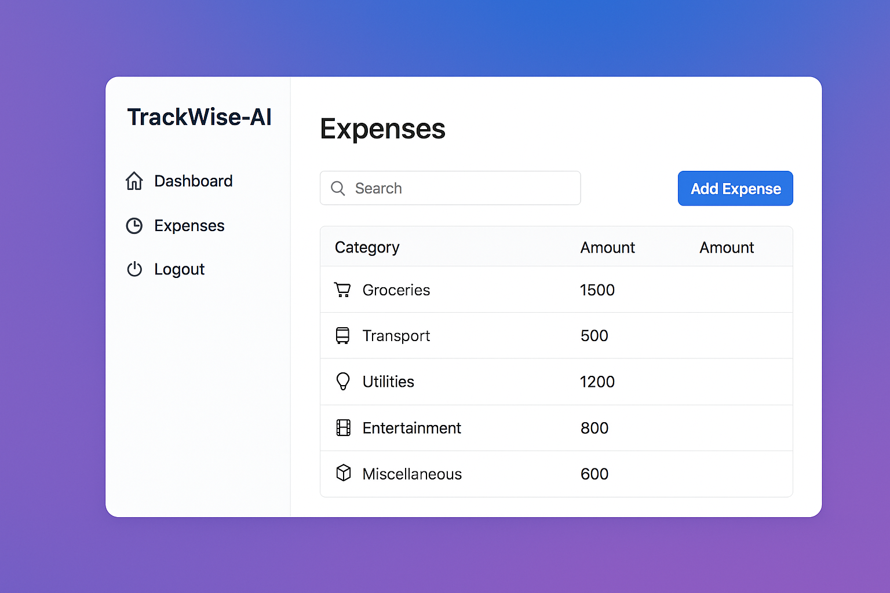

# TrackWise-AI

A secure expense tracker with **React frontend** and **Node.js/Express backend** using **AWS DynamoDB**.

## Features
- User authentication (Register, Login) with **bcrypt + JWT (HttpOnly cookies)**.
- Secure backend with **helmet, cors, rate-limiting, Joi validation**.
- Expense management: add, list, and view expenses.
- React frontend with simple UI (login, register, dashboard).
- Monorepo style: `/backend` and `/frontend`.

## Setup
### Backend
```sh
cd backend
cp .env.example .env
npm install
npm run dev
### Frontend
cd ../frontend
cp .env.example .env
npm install
npm start
